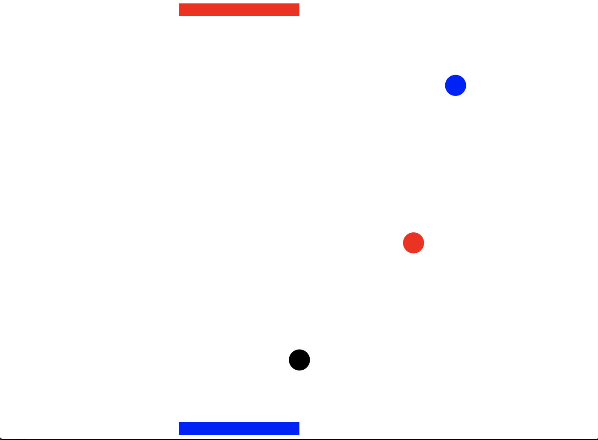

# pingpong-clojure

## Practice project for my clojure journey

<figure class="image">
  
  <figcaption><i>Example of gameplay. Blue and red balls are bonuses. Black one is actual ball.</i></figcaption>
</figure>

You can play local or online game. In practise, if application is deployed to hosting service two players can play agains each other with different computers (requires some minor tweaks currently).

Application contains two projects. Server and client. All game logic is on the server side and game state is transferred to client throw socket.

When game is running, only right and left movement is transferred to server side.
